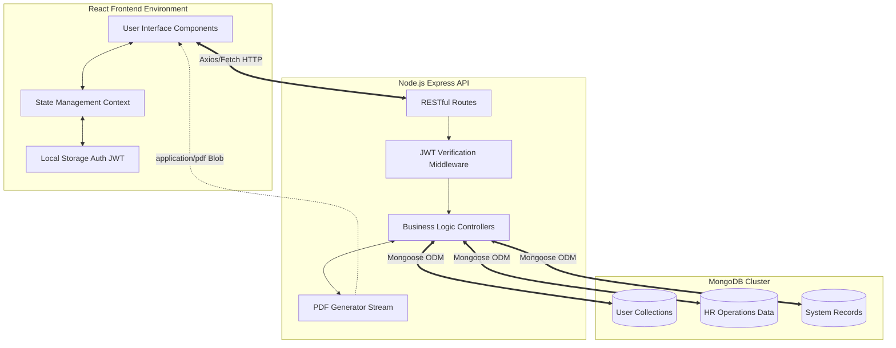
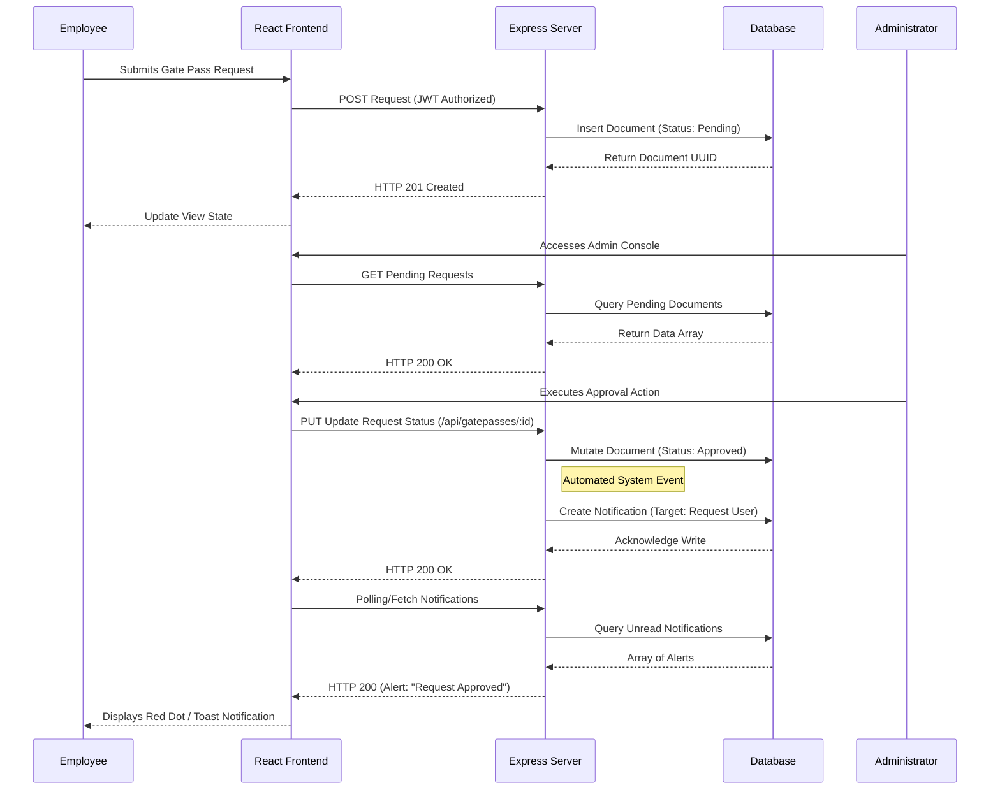
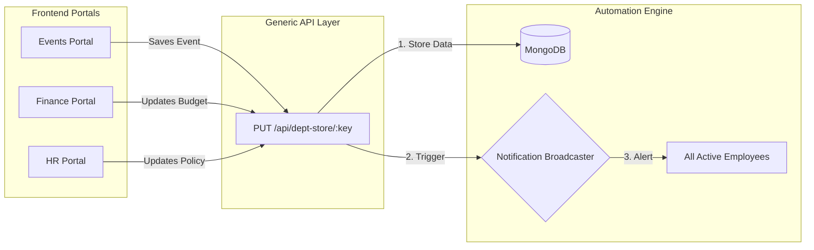
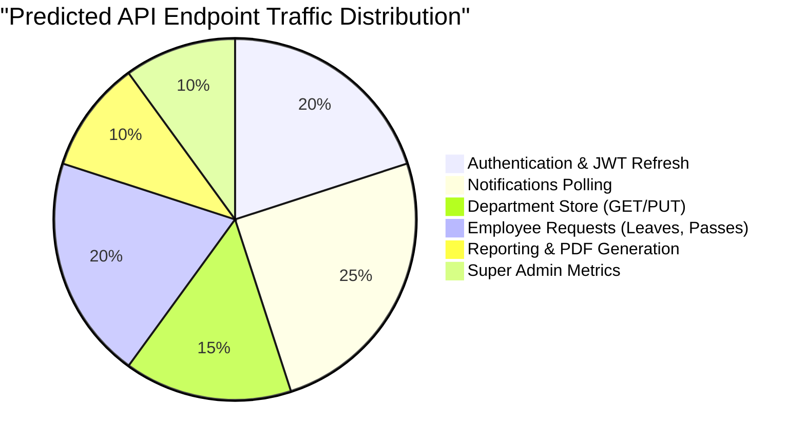
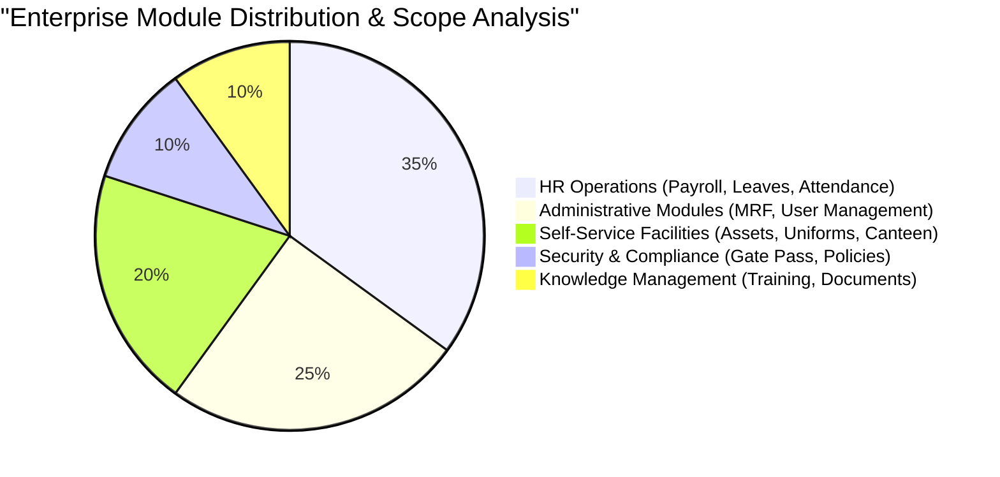

# SMG Employee Management Portal
## Comprehensive System Architecture and Technical Documentation

### 1. Abstract
The SMG Employee Management Portal is an enterprise-grade, full-stack web application designed to centralize Human Resources operations, employee self-service facilities, and administrative tracking. Built upon the MERN stack (MongoDB, Express.js, React, Node.js), it orchestrates a secure, scalable architecture bridging the gap between employees, department managers, and system administrators.

---

### 2. Directory Structure & Codebase Organization
The repository is strictly divided into two distinct environments to enforce the separation of concerns between client-side rendering and server-side orchestration.

```text
SMG-JUNE-2026/
├── frontend/                        # React / Vite Application
│   ├── src/
│   │   ├── components/              # Reusable UI widgets (Modals, Tables, Forms)
│   │   ├── pages/                   # Top-level view controllers (Dashboard, Leaves)
│   │   │   ├── admin/               # Administrative views and request aggregators
│   │   │   └── superadmin/          # System-wide oversight modules
│   │   ├── context/                 # React Context API for global state (Theme, Auth)
│   │   ├── services/                # Axios/Fetch abstractions for API communication
│   │   └── App.tsx                  # Core application router and layout wrapper
│   ├── package.json                 # Frontend dependencies
│   └── vite.config.ts               # Vite bundler configuration
│
├── backend/                         # Node.js / Express REST API
│   ├── models/                      # Mongoose ODM schemas (25+ collections)
│   ├── routes/                      # API endpoint definitions (apiRoutes.js)
│   ├── utils/                       # Helper functions (pdfGenerator.js)
│   ├── server.js                    # Application entry point and middleware configuration
│   ├── seed.js                      # Database initialization and mock data generator
│   └── package.json                 # Backend dependencies
│
└── README.md                        # Master architectural documentation
```

---

### 3. Technology Stack

| Architecture Layer | Core Technology | Primary Function & Justification |
| :--- | :--- | :--- |
| **Frontend UI** | React.js (Vite) | High-performance, component-based rendering. |
| **Styling** | Tailwind CSS | Utility-first CSS framework for rapid responsive design. |
| **Icons** | Lucide React | Lightweight, scalable vector graphics library. |
| **Backend Server** | Node.js / Express.js | Event-driven RESTful API orchestration. |
| **Database** | MongoDB / Mongoose | Document-oriented NoSQL persistence enabling rapid schema iteration. |
| **Authentication** | JWT & bcrypt | Cryptographic security and stateless session management. |
| **Binary Generation** | PDFKit | Server-side binary large object (Blob) generation for official documents. |

---

### 4. Testing Credentials

| Access Level | Authentication Email | Password | Role Permissions & Capabilities |
| :--- | :--- | :--- | :--- |
| **Super Admin** | `superadmin@smg.com` | `admin123` | Full system control, department management, global analytics. |
| **Administrator** | `admin@smg.com` | `admin123` | Approval authority, HR management, specific analytics. |
| **Department Head**| `dept@smg.com` | `admin123` | Department-level request approvals, shift management. |
| **Employee** | `employee@smg.com` | `emp123` | Self-service leaves, gate passes, payroll, training enrollment. |

---

### 5. Detailed RESTful API Specifications

The following table comprehensively details the primary backend endpoints, identifying the HTTP Method, Route path, expected Request Payload, Authorization Requirements, and expected Response types.

| Method | Endpoint Route | Authorization | Request Payload (Body) | Primary Controller Function & Expected Output |
| :--- | :--- | :--- | :--- | :--- |
| **POST** | `/api/login` | Public | `{ email, password }` | Authenticates user against bcrypt hash. Returns User Object + JWT Token. |
| **GET** | `/api/user/:id` | Bearer Token | None | Fetches extensive user schema including skills, education, and arrays. |
| **GET** | `/api/admin/dashboard` | Admin Token | None | Aggregates cross-collection metrics (Pending leaves, active users). |
| **GET** | `/api/admin/requests` | Admin Token | None | Fetches a unified chronological array of all pending system requests. |
| **PUT** | `/api/admin/requests/:id/approve`| Admin Token | `{ type: "Leave" }` | Mutates specific request status to `Approved` in target collection. |
| **POST** | `/api/leaves` | Bearer Token | `{ user, type, from, to... }` | Instantiates a new Leave document. Defaults status to `Pending`. |
| **POST** | `/api/gatepasses` | Bearer Token | `{ user, outTime, inTime... }` | Creates a Gate Pass document tracking premise exit logic. |
| **GET** | `/api/documents/:userId` | Bearer Token | None | Retrieves metadata array of all securely uploaded employee files. |
| **GET** | `/api/trainings` | Bearer Token | None | Retrieves active Training catalogs including populated instructor data. |
| **PUT** | `/api/trainings/:id/enroll` | Bearer Token | `{ userId }` | `$addToSet` push operation adding user ID to the `enrolledUsers` array. |
| **GET** | `/api/pdf/payslip/:id` | Bearer Token | None | Executes PDFKit layout and pipes `application/pdf` binary blob stream. |
| **GET** | `/api/pdf/gatepass/:id`| Bearer Token | None | Compiles Gate Pass data into a printable, authenticated PDF format. |
| **GET** | `/api/pdf/leave/:id` | Bearer Token | None | Generates an official Leave Application PDF receipt for compliance. |

---

### 6. System Architecture Diagram

This flowchart illustrates the unidirectional data flow and interaction between the discrete layers of the application.



---

### 7. Core Application Logic (Request Approval Sequence & Notification Broadcast)

This sequence diagram traces the definitive lifecycle of a standard business process (e.g., an Employee Gate Pass) and demonstrates our automated Notification Engine.



---

### 8. Deep Dive: Backend Automation & Generic Department Store

The SMG Portal implements a highly sophisticated, generic data persistence layer that replaces static mocks with dynamic MongoDB synchronization.

**1. Department Data Store API (`/api/dept-store/:key`)**
Instead of creating 50 separate CRUD endpoints for minor departmental functions (e.g., Events, Finance Budgets), the system uses a universal polymorphic endpoint. 
- **GET** fetches the JSON payload associated with a specific key.
- **PUT** overwrites the payload and critically **triggers a Global Broadcast Notification**.

**2. Automated Notification Broadcaster**
When a department updates its generic store (e.g., creating a Townhall Event), the backend intercepts this `PUT` request. It queries all active employees and uses `Notification.insertMany()` to instantly alert the entire company.



---

### 9. API Traffic Distribution (Estimated)



---

### 10. Complete Database Schema (Entity Relationship)

The following intense ER Diagram defines the strict schema constraints, data types, and collection bindings managed within MongoDB via Mongoose.

```mermaid
erDiagram
    %% Core Entities
    USER {
        ObjectId _id PK
        String empId UK "e.g., SMG-2024-042"
        String email UK
        String password "bcrypt hashed"
        String name
        String role "employee | admin | superadmin | department"
        String dept
        ObjectId reportingTo FK "Manager Reference"
        Array education "[{degree, institution, year, grade}]"
        Array certifications "[{name, issuer, year}]"
        Array skills "[String]"
        Boolean isActive "Default: true"
    }

    DEPARTMENT {
        ObjectId _id PK
        String name UK
        ObjectId head FK "User ID"
        String description
    }

    ATTENDANCE {
        ObjectId _id PK
        ObjectId user FK
        Date date
        Date checkIn
        Date checkOut
        String status "Present | Absent | Half Day"
        Number hoursWorked
    }

    LEAVE {
        ObjectId _id PK
        ObjectId user FK
        String type "Annual | Sick | Casual"
        Date from
        Date to
        Number days
        String reason
        String status "Pending | Approved | Rejected"
        ObjectId approver FK
    }

    PAYROLL {
        ObjectId _id PK
        ObjectId user FK
        Number month
        Number year
        Number basic
        Number netSalary
        String status "Paid | Pending"
    }

    GATE_PASS {
        ObjectId _id PK
        ObjectId user FK
        Date date
        String outTime
        String inTime
        String reason
        String status "Pending | Approved | Rejected"
    }

    ASSET_REQUEST {
        ObjectId _id PK
        ObjectId user FK
        String assetType
        String priority "High | Medium | Low"
        String status "Pending | Allocated | Rejected"
    }

    TRAINING {
        ObjectId _id PK
        String title
        Date date
        Number duration "Hours"
        Boolean mandatory
        Array enrolledUsers FK "[User IDs]"
        Array completedUsers FK "[User IDs]"
    }

    DOCUMENT {
        ObjectId _id PK
        ObjectId user FK
        String title
        String category "Identity | Payroll | Offer | Experience"
        String fileType "PDF | DOCX"
        String filePath
        Date uploadedAt
    }

    MRF {
        ObjectId _id PK
        String department
        String position
        Number vacancies
        String status "Pending | Approved | Filled"
    }

    INTERVIEW {
        ObjectId _id PK
        ObjectId mrfId FK
        String candidateName
        Date schedule
        String status "Scheduled | Selected | Rejected"
        ObjectId interviewer FK "User"
    }

    %% Relational Mapping Logic
    USER ||--o{ USER : "reports to"
    DEPARTMENT ||--o{ USER : "contains employees"
    USER ||--o| DEPARTMENT : "heads department"

    USER ||--o{ ATTENDANCE : "logs daily"
    USER ||--o{ LEAVE : "applies for"
    USER ||--o{ PAYROLL : "receives monthly payout"
    USER ||--o{ GATE_PASS : "requests premise exit"
    USER ||--o{ ASSET_REQUEST : "submits hardware request"
    USER ||--o{ DOCUMENT : "uploads/owns securely"
    USER }|--o{ TRAINING : "enrolls & completes"
    
    USER ||--o{ MRF : "raises requisition"
    MRF ||--o{ INTERVIEW : "schedules candidate"
    USER ||--o{ INTERVIEW : "conducts evaluation"
```



---

### 11. Subsystem Categorization Analysis



---

### 12. Initialization & Deployment Procedures

To initialize the environment for development or production deployment, execute the following commands in their respective module directories.

#### **Backend Services Initialization:**
```bash
cd backend
npm install
# Set JWT_SECRET and MONGO_URI in a .env file prior to execution
node server.js
```

#### **Frontend Application Initialization:**
```bash
cd frontend
npm install
npm run dev
# The application will bind to http://localhost:5173 by default
```

#### **Database Configuration:**
Ensure a local MongoDB daemon is operating on port `27017` or configure the `.env` file to establish a secure connection with a hosted MongoDB Atlas cluster URI.
```bash
# Seed the initial mock data (Users, Departments, etc.)
cd backend
node seed.js
```

---
*Confidentiality Notice: This repository contains the intellectual property of SMG Enterprises. Unauthorized duplication or distribution is prohibited.*
