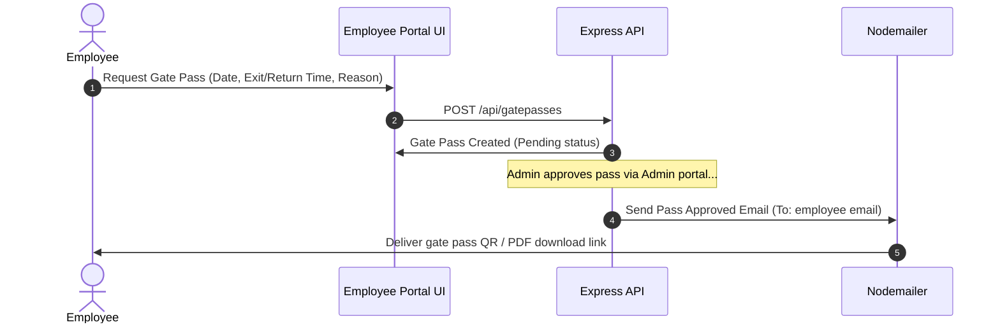

# Employee Portal Workflows & Feature Flow

The **Employee Portal** allows team members to submit, track, and manage requests for leaves, gate passes, transport logistics, asset assignments, uniform requests, and canteen orders.

---

## 🛠️ Key Workflows

### 1. Leave Request Submission & Approval Flow
1.  **Submit Request**: Employee navigates to **Leaves** tab, inputs start date, end date, leave type, and reason, and clicks "Submit".
2.  **State Insertion**: Leaves are recorded under the `/leaves` database collection.
3.  **HOD Review**: HR / Department head logs into the Portal Hub, views leaves list, and selects "Approve" or "Reject".
4.  **Notification**: An automated notification is instantly broadcasted to the requesting employee's profile stating "Your leave request has been approved/rejected".

### 2. Gate Pass Generation Flow

### 3. Canteen & Uniform Checkout Workflows
*   **Canteen Order**: Employees browse available meals, check out, and receive a generated QR ticket token to present at the canteen desk.
*   **Uniform Allocation**: Uniform sizing requests are submitted to HR and matched with active inventory sizes.
