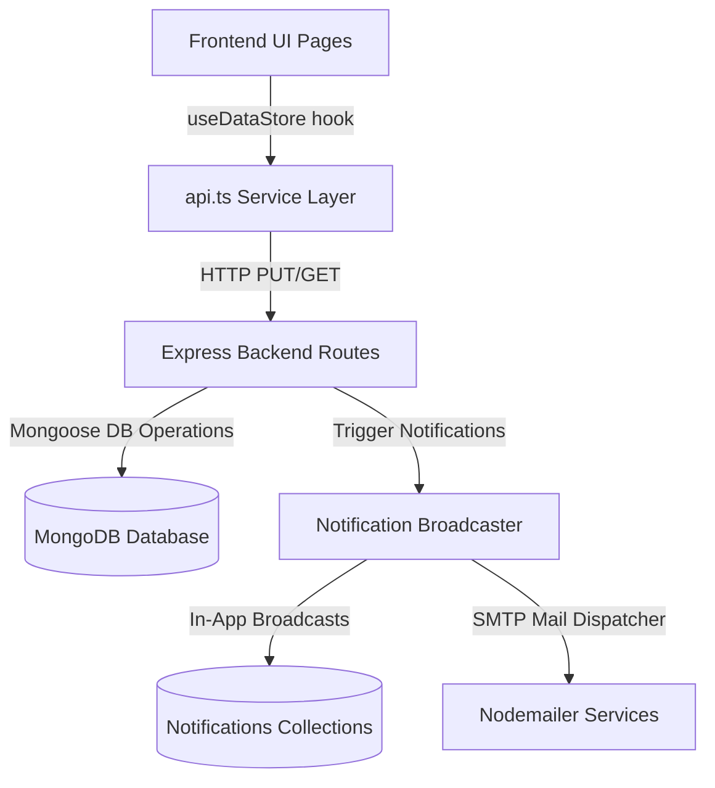

# Portals Workflows and Core Features Flow - SMG Employee Management Portal

This directory contains comprehensive flow diagrams, walkthroughs, and descriptions of the workflows across all core portals within the SMG system.

---

## 📂 Directory Structure

*   [**`README.md`**](file:///d:/JUNEINTERN/READMEPORTALSFLOW/README.md): Current overview file.
*   [**`RECEPTION_PORTAL_FLOW.md`**](file:///d:/JUNEINTERN/READMEPORTALSFLOW/RECEPTION_PORTAL_FLOW.md): Workflow details for Front Desk and Reception operations.
*   [**`EMPLOYEE_PORTAL_FLOW.md`**](file:///d:/JUNEINTERN/READMEPORTALSFLOW/EMPLOYEE_PORTAL_FLOW.md): Workflows for employee request submissions (Leave, Gatepass, Transport, SIM, etc.).
*   [**`SUPER_ADMIN_FLOW.md`**](file:///d:/JUNEINTERN/READMEPORTALSFLOW/SUPER_ADMIN_FLOW.md): Workflows for administrative overview, user management, and system health checks.

---

## 🔑 Default Portal Access Credentials

### 1. Department Portal Hub
*   **Access Route**: Navigate to `/department-portal` or select "Department Portal" from the login page.
*   **Security Access Key**: `dept123` (Department Hub authentication passkey)
*   **Reception Credentials**:
    *   **User ID**: `reception`
    *   **Password**: `reception123`

### 2. Employee Portal / Employee Login
*   **Access Route**: `/login` (Default root login page, select "Employee Portal" tab)
*   **Test Employee Credentials**:
    *   **Email**: `employee@smg.com`
    *   **Password**: `employee123`

### 3. Super Admin Portal / Dashboard
*   **Access Route**: `/login` (Default root login page, select "Admin Portal" tab)
*   **Super Admin Credentials**:
    *   **Email**: `admin@smg.com`
    *   **Password**: `admin123`

---

## 🔄 Core Synchronization Architecture

All portal components communicate with the central Mongoose-backed Express API endpoints (`/api/dept-store/:key`), which eliminates mock data completely:

