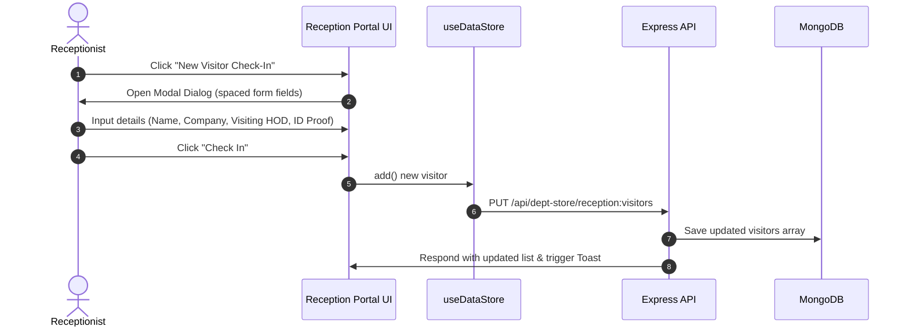
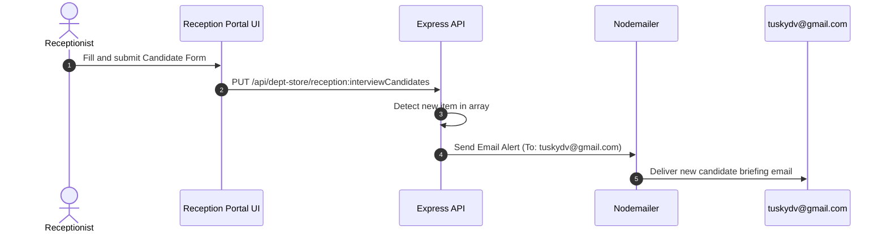

# Reception Portal Workflows & Feature Flow

The **SMG Reception Portal** serves as the central administrative interface for managing corporate guests, interview candidates, government officials, gate security credentials, and key checkout records.

---

## ✅ Tested Features

The following Reception Portal features have been manually tested and verified:

- [x] New Visitor Check-In
- [x] Visitor Check-Out
- [x] View Visitor Details
- [x] Active Visitors Listing
- [x] Print Visitor Log
- [x] Corporate Guest Registration
- [x] Interview Candidate Registration
- [x] Government Official Registration

> Note: Testing completed on 05-Jun-2026.

## 🛠️ Main Navigation & Sections

The portal contains several key views accessible via the sidebar:
1.  **Overview**: Dashboard metrics, system date & time sync, and a live "Recent Activity" ticker of visitors checking in and checking out.
2.  **Visitor Desk**: Main visitor registration desk supporting checking in normal walk-in visitors.
3.  **Corporate Guests**: Form to pre-register corporate guests, displaying designation, HOD approval, and list of pending vs approved guest passes.
4.  **Interview Candidates**: Register interview candidates, track department requirements, interviewer assignments, and HR coordinator details.
5.  **Government Officials**: Security clearance checks, tracking governmental rank, ministry department, and host matching.
6.  **Keys Management**: Issue keys, track return state (issued, available, locked), location mappings, and authorized checkers.
7.  **Key Representatives**: Listing of key personnel, their access clearance level, and editable Special Instructions/Note taking logs.
8.  **Active Visitors**: Real-time filtering grid of currently active guests in the building with options to check out.
9.  **Visitor History**: Comprehensive checked-out visitors logs with detailed visit history.
10. **Analytics**: Visual summary of visitors categories, peak times, and total checked-in statistics.
11. **Settings**: Operating hours adjustments, badge prefix, and notification parameters.

---

## 🔄 Reception Registration & Event Flows

### 1. New Visitor Check-In Flow


### 2. Interview Candidate & HR Notification Flow
*   **Trigger**: Reception registers an interview candidate (either via "Register Candidate" dialog or a Visitor of type "candidate" checks in).
*   **Email Alert**: The backend routes (`backend/routes/apiRoutes.js`) intercept this operation and dispatch an immediate email alert via SMTP/Nodemailer to the HR coordinator email `tuskydv@gmail.com`.


### 3. Key Representatives Notes Management Flow
*   **Special Instructions Update**: Allows inline note editing for Key Representatives cards.
*   **Flow**:
    1.  Go to **Key Representatives** tab.
    2.  Click **Edit** on a representative card's notes block.
    3.  A dialog modal opens containing a text area pre-populated with current instructions.
    4.  Save changes: Sends an API update to `/api/dept-store/reception:keyPersons` to update the representative's `specialInstructions` property persistently in MongoDB.

---

## 💾 Database Schema & Frontend-to-Backend Connection

The Reception Portal is fully persistent and integrated with the MongoDB backend. Instead of using localized `localStorage` mocks, all frontend tables interact with the generic `DepartmentData` schema.

### 1. MongoDB Database Schema (`DepartmentData`)

Each reception sub-tab persists its records under a unique `storeKey` in the `DepartmentData` collection:

```json
{
  "_id": "ObjectId",
  "storeKey": "reception:visitors",
  "items": [
    {
      "id": "unique-uuid",
      "name": "John Doe",
      "company": "Tech Corp",
      "phone": "+91 9876543210",
      "email": "john@techcorp.com",
      "visitingPerson": "Jane Smith",
      "department": "HR",
      "visitorType": "candidate",
      "purpose": "Interview for Senior Dev role",
      "idProof": "Aadhaar Card",
      "idProofNumber": "1234-5678-9012",
      "vehicleNumber": "DL 3C AM 4567",
      "materialsBrought": "Laptop",
      "checkInTime": "10:15 AM",
      "checkOutTime": null,
      "status": "Checked In",
      "date": "2026-06-05"
    }
  ],
  "department": "reception",
  "lastUpdatedBy": "reception",
  "createdAt": "2026-06-05T08:00:00.000Z",
  "updatedAt": "2026-06-05T08:15:00.000Z"
}
```

#### Mapping of storeKeys:
*   `reception:visitors` -> Walk-in Visitor records.
*   `reception:corporateGuests` -> Corporate Guests records.
*   `reception:interviewCandidates` -> Interview Candidates records.
*   `reception:governmentOfficials` -> Government Officials records.
*   `reception:keys` -> Key checkouts and statuses.
*   `reception:keyPersons` -> Key personnel details and Special Instructions notes.

---

### 2. Frontend-to-Backend Architecture

```mermaid
graph TD
    subgraph Frontend (React / Tailwind)
        A[ReceptionPortal.tsx] -->|useDataStore hook| B[api.ts service layer]
        B -->|fetchDepartmentData| C[GET /api/dept-store/:key]
        B -->|saveDepartmentData| D[PUT /api/dept-store/:key]
    end

    subgraph Backend (Express / Mongoose)
        C --> E[apiRoutes.js handler]
        D --> E
        E -->|Mongoose queries| F[(MongoDB: DepartmentData)]
        E -->|Trigger Candidate / Visitor checks| G[Nodemailer Dispatcher]
    end

    subgraph External Email
        G -->|SMTP Alert| H[tuskydv@gmail.com]
    end
```
