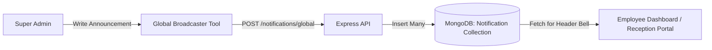

# Super Admin Portal Workflows & Feature Flow

The **Super Admin Portal** serves as the cockpit for managing the entire SMG infrastructure. It coordinates global user settings, runs system vital signs monitoring, and broadcasts system-wide notifications.

---

## 🛠️ Main Features

### 1. System Health Dashboard (Vitals Monitor)
*   **Database Health**: Checks the MongoDB Mongoose connection state (`readyState === 1` for green check).
*   **SMTP Mail Server Status**: Verifies that the `.env` file contains valid `SMTP_USER` and `SMTP_HOST` variables, ensuring notification mail delivery is active.
*   **Active Portals Monitor**: Tracks activity logs across all 12 department portals.

### 2. Global Notification Broadcaster
*   **Broadcaster tool**: Admins can write a system-wide announcement.
*   **Database write**: The notification is created for all active employee IDs in the `notifications` collection.
*   **Instant delivery**: Real-time polling or dashboard reload instantly draws the user's attention.

